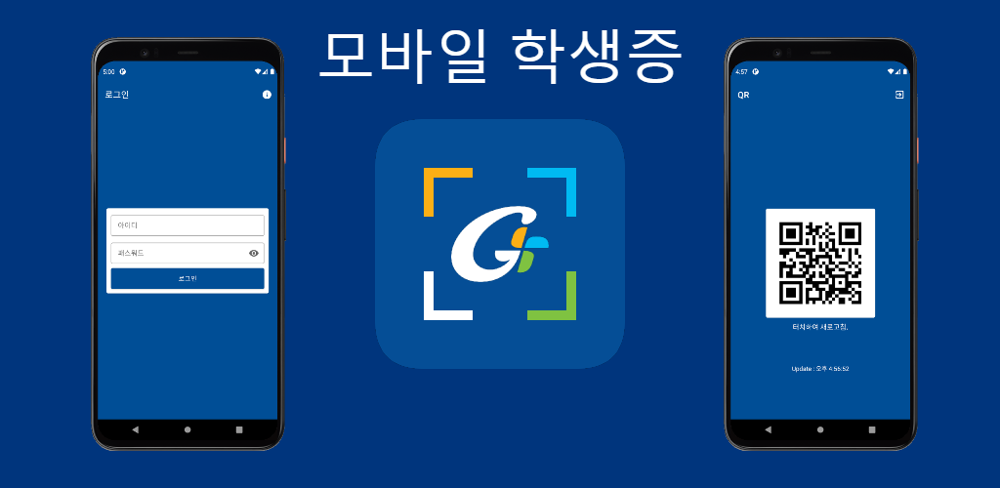
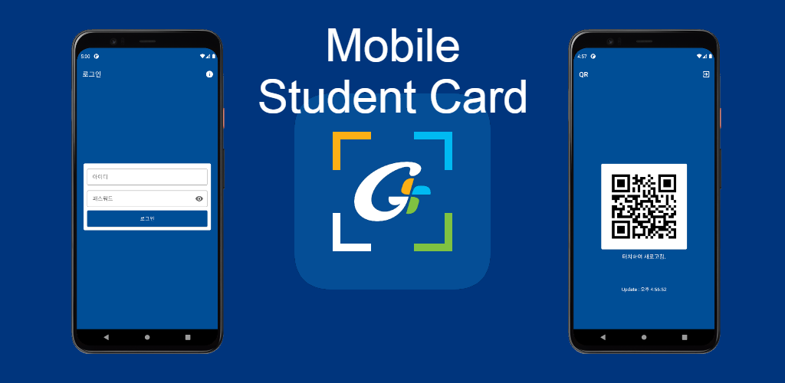
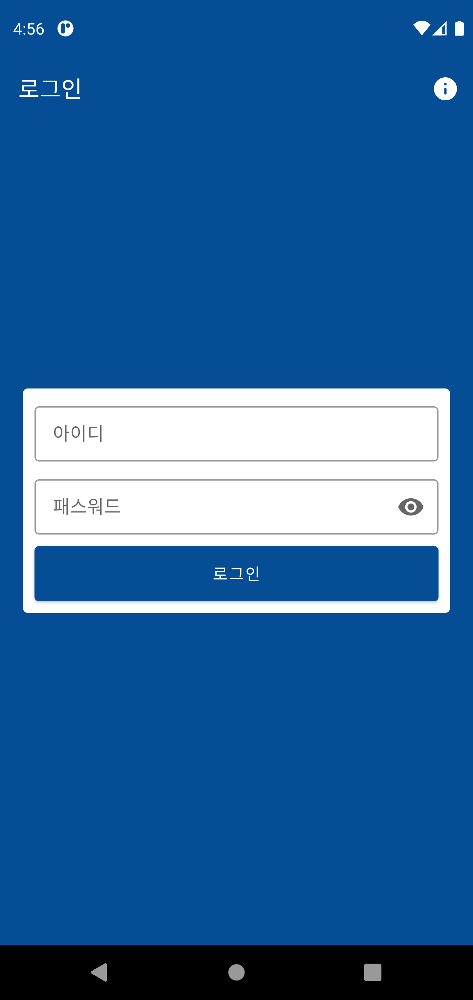
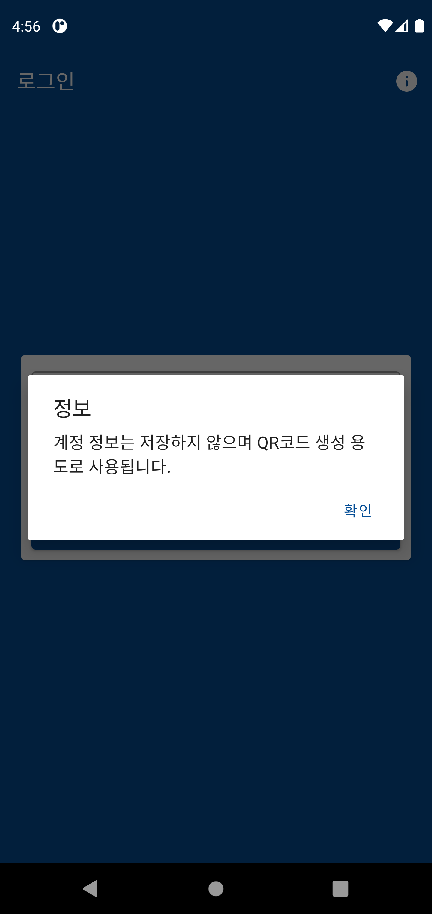
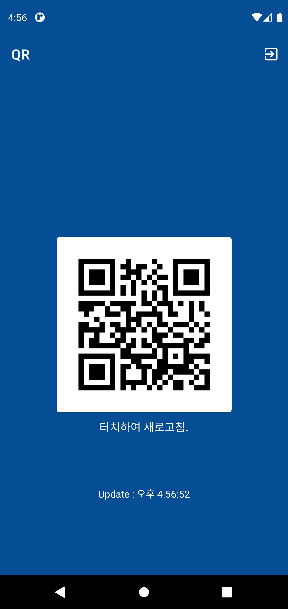
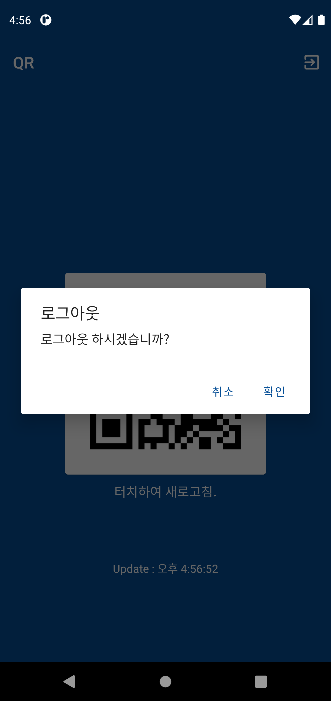
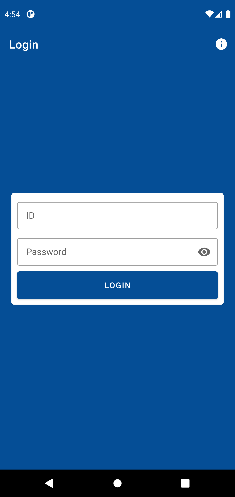
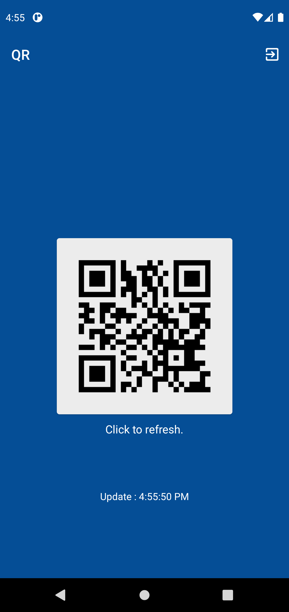
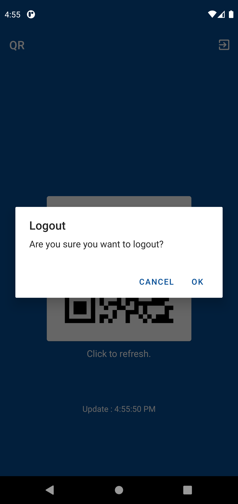

# Gachon-QR

가천대학교 QR Code 생성기
Gachon University Student QR Code Generator

https://play.google.com/store/apps/details?id=com.taetae98.gachonqr

## ⚡ Features
* 스마트 가천 API : 학교 API를 사용하여 계정이 존재하는지 확인 후 정보를 조회합니다.
* SmartGachon API : Use the school API to check if an account exists and inquire the information.

* 다양한 언어 지원 : 한국어와 영어를 지원해서 외국인 학생들도 사용할 수 있습니다.
* Multi Language : It supports Korean and English, so foreign students can use it.

* 오프라인 지원 : 데이터를 연결하지 않아도 빠르게 사용할 수 있습니다.
* Support Offline : You can use it quickly without having to connect data.

* 개인정보 보호 : 아이디, 패스워드 같은 민간함 정보를 저장하지 않고 QR 생성에 필요한 최소한의 정보를 암호화 하여 저장합니다.
* Personal information protection : Encrypt and store the minimum information required for QR generation without storing private information such as ID and password.

## 😊 Introduction
* #### 한국어

* #### English

